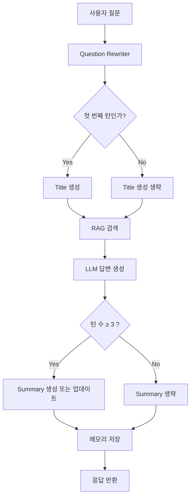

# 멀티턴 대화 고도화 설계

## 목표
멀티턴 대화 품질과 비용 효율을 개선하기 위해 다음과 같이 설계한다.

- **Title 생성은 최초 1회만 수행**
- **Summary는 대화가 3턴 이상 누적되었을 때부터 생성/갱신**

---

## 전체 대화 흐름



## 구성 요소

### 1. Question Rewriter
- 이전 대화 문맥을 활용하여 **독립적인 질문(standalone question)**으로 재작성한다.
- 목적
  - 검색 품질 향상
  - 멀티턴 문맥 반영
- 예시
```
사용자: 그럼 높이는?
→ Rewrite: 백두산의 높이는 얼마인가?
```

### 2. Title Generator
- 대화의 주제를 나타내는 짧은 제목을 생성한다.
- 실행 조건
  - turn_count == 1
- 예시
```
사용자: 백두산 높이는 얼마야?
Title: 백두산 높이 질문
```

### 3. Conversation Summary Generator
- 3턴 이상 대화가 누적되었을 때부터 실행
- 조건
  - turn_count >= 3
- 역할
  - 이전 대화 핵심 내용 압축
  - 장기 메모리 역할
  - 이후 Question Rewrite 품질 향상
- 예시 Summary
```
사용자는 백두산의 높이와 위치에 대해 질문하였다.
어시스턴트는 백두산의 높이와 중국-북한 국경에 위치한다는 정보를 설명하였다.
```

## 실행 규칙 

| 기능               | 실행 조건             | 실행 빈도  |
| ---------------- | ----------------- | ------ |
| Title 생성         | `turn_count == 1` | 1회     |
| Summary 생성       | `turn_count % 3 == 0` | 3 턴 마다 |
| Question Rewrite | 모든 질문             | 매 턴    |


